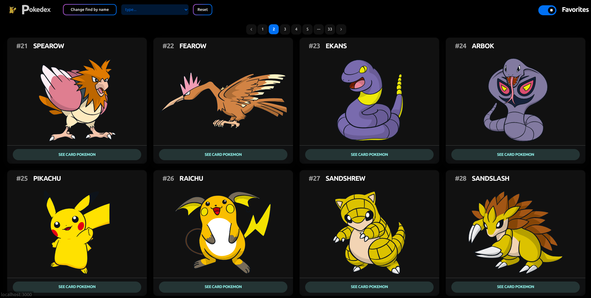

# Pokedex
> Pokédex es una aplicación que te permite explorar y obtener información detallada sobre diferentes Pokémon. Esta aplicación está construida con tecnologías modernas y utiliza Docker para facilitar el despliegue y Swagger para una documentación clara de la API.

```bash
git clone git@github.com:adrian947/pokemon-challenge.git
```
--- 
## Inicio rápido
Para ejecutar la aplicación localmente, sigue estos sencillos pasos:

1- Clona este repositorio:

```bash
git clone git@github.com:adrian947/pokemon-challenge.git
```
2- Dentro de la carpeta **Node-pokemon-back** cambia el archivo `.env.example` por `.env` (dejo variables de ejemplo, puedes usar las mismas o cambiarlas)

3- Asegurate de estar dentro de la carpeta **pokemon-challenge** y ejecuta:
```bash
docker-compose up
```

Ahora, la aplicación estará disponible en http://localhost:3000.

### Backend  y Documentación
El servidor correra en http://localhost:5000 por lo que si deseas ver la documentación y probar los endpoints puedes ingresar a http://localhost:5000/docs. No olvides usar el endpoint para loguearte copiar el token y pegarlo dentro de `Authorize`, los endpoint estan protejidos y necesitas un *JWT* para ingresar :wink:.

# Testing

Los test se ejecutaran cuando la imagen se este construyendo. A continuación dejo la explicación de como levantar el proyecto de forma individual

## Backend
 
Asegurate estar dentro de la carpeta **Node-pokemon-back**

1- Instalar dependencias 
```bash
npm install
```
2- Levantar server
```bash
npm start
```
**Si deseas ejecutar los test:**
```bash
npm test
```
## Front
 
Asegurate estar dentro de la carpeta **Next-pokemon-front**

1- Instalar dependencias 
```bash
yarn install
```
2- Levantar app
```bash
yarn dev
```

### ¡Disfruta explorando la Pokédex!

